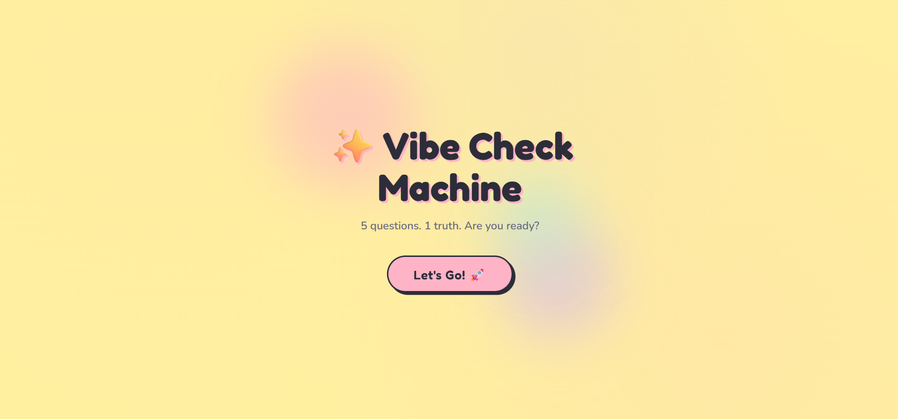

# 🎯 Vibe Checking (First JS App)

A fun and interactive JavaScript web app that checks the user's mood or “vibe” based on their input and displays a dynamic response.

---

## 🚀 Features

* Takes user input
* Analyzes the “vibe” using JavaScript logic
* Displays a matching mood/result dynamically
* Simple and responsive UI

---

## 🛠️ Technologies Used

* HTML
* CSS
* JavaScript

---

## ▶️ How to Run Locally

1. Download or clone this repository
2. Open the project folder
3. Double-click on **index.html**

OR

* Open with **Live Server** in VS Code

---

## 📂 Project Structure

vibe-checking-app/
│── index.html
│── style.css
│── script.js

---

## 💡 Learning Outcome

This project helped me understand:

* Basic JavaScript logic
* DOM manipulation
* Handling user input
* Creating interactive web applications

---
## 📸 Preview

## 👩‍💻 Author

Ayesha Chouhadry
Computer Science Student (4th Semester)
Islamia University Bahawalpur

---

